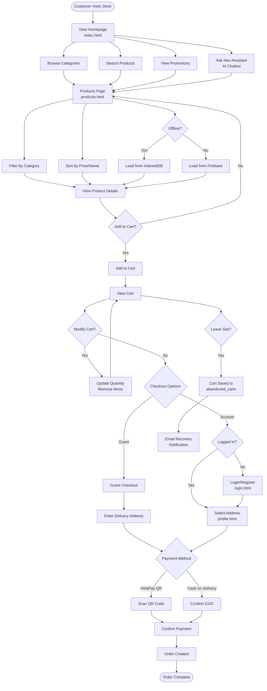
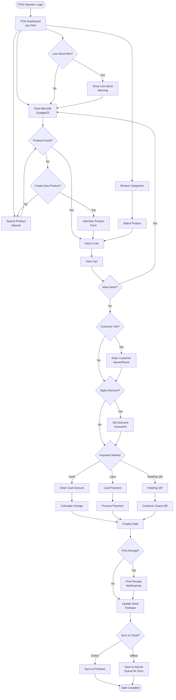
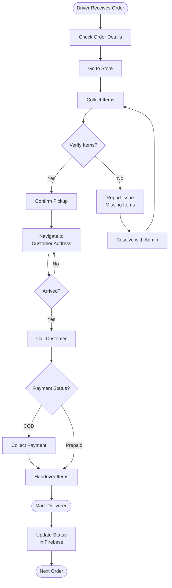
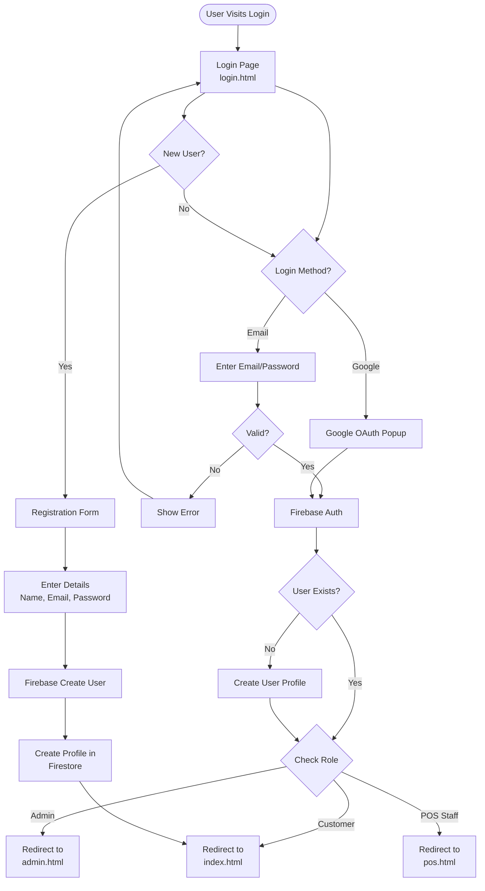
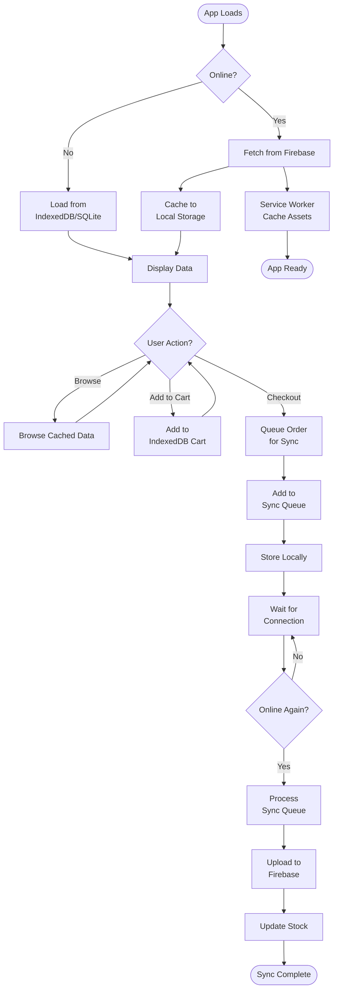
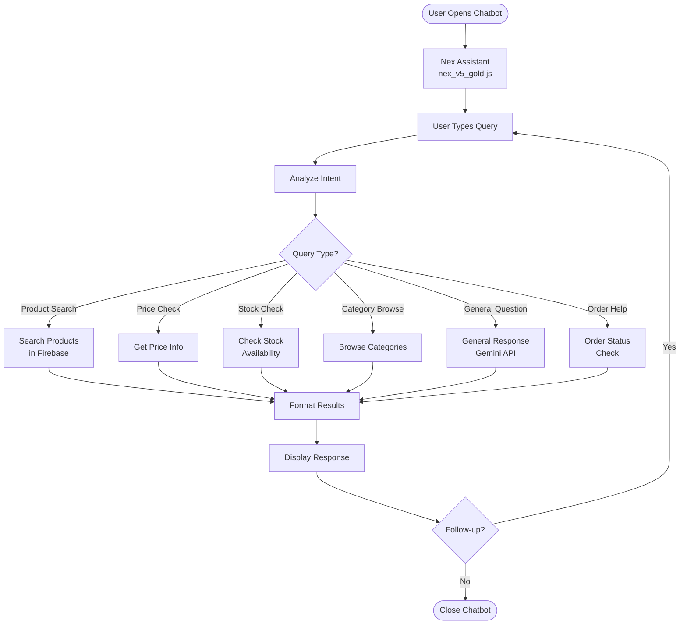
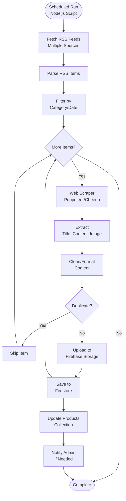
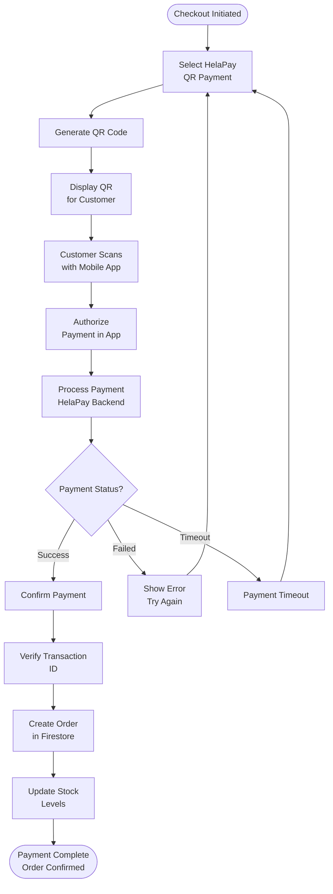

# Buddika Stores - User Flow Diagrams

> Generated: 2026-04-25

---

## 3. Customer Shopping Flow

---

## 4. POS Operator Flow

---

## 5. Admin Dashboard Flow

```mermaid
flowchart TD
    START([Admin Login]) --> ADMIN[Admin Dashboard<br/>admin.html]

    ADMIN --> NAV{Navigation Choice}

    NAV --> PRODUCTS_TAB[Products Tab]
    NAV --> SALES_TAB[Sales Tab]
    NAV --> INVENTORY_TAB[Inventory Tab]
    NAV --> FINANCE_TAB[Finance Tab]
    NAV --> PROMOTIONS_TAB[Promotions Tab]
    NAV --> BUNDLES_TAB[Bundles Tab]
    NAV --> NEWS_TAB[News Tab]
    NAV --> SETTINGS_TAB[Settings Tab]

    %% Products Management
    PRODUCTS_TAB --> PROD_LIST[View Products List]
    PROD_LIST --> PROD_ACTION{Action?}
    PROD_ACTION -->|Add| PROD_ADD[Add New Product]
    PROD_ACTION -->|Edit| PROD_EDIT[Edit Product]
    PROD_ACTION -->|Delete| PROD_DELETE[Delete Product]
    PROD_ACTION -->|Import| PROD_IMPORT[Import from Excel<br/>SheetJS]

    PROD_ADD --> PROD_SAVE[Save to Firebase]
    PROD_EDIT --> PROD_SAVE
    PROD_DELETE --> PROD_CONFIRM{Confirm?}
    PROD_CONFIRM -->|Yes| PROD_DEL[Remove from Firebase]
    PROD_CONFIRM -->|No| PROD_LIST
    PROD_IMPORT --> PROD_PARSE[Parse Excel]
    PROD_PARSE --> PROD_BATCH[Batch Upload]
    PROD_BATCH --> PROD_SAVE

    %% Sales Analytics
    SALES_TAB --> SALES_VIEW[View Sales Dashboard]
    SALES_VIEW --> SALES_CHARTS[Charts & Graphs<br/>Chart.js]
    SALES_VIEW --> SALES_FILTER[Filter by Date/Category]
    SALES_VIEW --> SALES_EXPORT[Export to Excel]

    %% Inventory Management
    INVENTORY_TAB --> INV_VIEW[View Stock Levels]
    INV_VIEW --> INV_ALERT[Low Stock Alerts]
    INV_VIEW --> INV_MOVEMENT[Stock Movements]
    INV_VIEW --> INV_REORDER[Generate Reorder List]

    %% Finance Tracking
    FINANCE_TAB --> FIN_VIEW[View Financial Dashboard]
    FIN_VIEW --> FIN_DEPOSIT[Record Deposit]
    FIN_VIEW --> FIN_EXPENSE[Record Expense]
    FIN_VIEW --> FIN_CREDIT[Manage Credit Sales]
    FIN_VIEW --> FIN_SUMMARY[Daily Summary]

    %% Promotions
    PROMOTIONS_TAB --> PROMO_LIST[View Promotions]
    PROMO_LIST --> PROMO_ACTION{Action?}
    PROMO_ACTION -->|Create| PROMO_NEW[Create Promotion]
    PROMO_ACTION -->|Edit| PROMO_EDIT[Edit Promotion]
    PROMO_ACTION -->|Toggle| PROMO_TOGGLE[Activate/Deactivate]

    %% Bundles
    BUNDLES_TAB --> BUNDLE_LIST[View Bundles]
    BUNDLE_LIST --> BUNDLE_ACTION{Action?}
    BUNDLE_ACTION -->|Create| BUNDLE_NEW[Create Bundle<br/>Select Products]
    BUNDLE_ACTION -->|Edit| BUNDLE_EDIT[Edit Bundle]
    BUNDLE_ACTION -->|Toggle| BUNDLE_TOGGLE[Activate/Deactivate]

    %% News Management
    NEWS_TAB --> NEWS_LIST[View News Articles]
    NEWS_LIST --> NEWS_ACTION{Action?}
    NEWS_ACTION -->|Add| NEWS_ADD[Add Article]
    NEWS_ACTION -->|Edit| NEWS_EDIT[Edit Article]
    NEWS_ACTION -->|Delete| NEWS_DELETE[Delete Article]

    %% Settings
    SETTINGS_TAB --> SET_VIEW[View Settings]
    SET_VIEW --> SET_EDIT[Edit Configuration]
    SET_EDIT --> SET_API[Update API Keys<br/>Gemini, etc.]
    SET_EDIT --> SET_FEES[Update Courier Fees]
    SET_EDIT --> SET_HOURS[Update Store Hours]

    %% Back Navigation
    PROD_SAVE --> ADMIN
    PROD_DEL --> ADMIN
    SALES_EXPORT --> ADMIN
    INV_REORDER --> ADMIN
    FIN_SUMMARY --> ADMIN
    PROMO_TOGGLE --> ADMIN
    BUNDLE_TOGGLE --> ADMIN
    NEWS_DELETE --> ADMIN
    SET_EDIT --> ADMIN
```

---

## 6. Delivery Driver Flow

---

## 7. Authentication Flow

---

## 8. Offline & Sync Flow

---

## 9. AI Chatbot (Nex Assistant) Flow

---

## 10. Newspaper Automation Flow

---

## 11. Payment Integration Flow (HelaPay)

