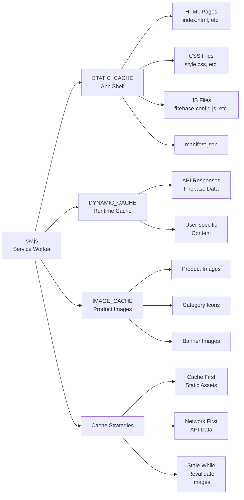
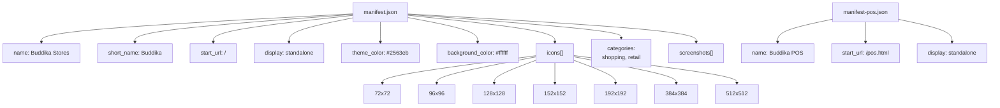

# Buddika Stores - Project File Structure

> Generated: 2026-04-25

---

## 12. Complete Directory Structure

```mermaid
graph TD
    ROOT["d:\shop\web site php\"]

    ROOT --> HTML_PAGES["HTML Pages"]
    ROOT --> ASSETS["assets/"]
    ROOT --> BACKEND["backend/"]
    ROOT --> ELECTRON["electron-app/"]
    ROOT --> SCRIPTS["scripts/"]
    ROOT --> CONFIG_FILES["Config Files"]

    %% HTML Pages
    HTML_PAGES --> INDEX["index.html<br/>Main Storefront"]
    HTML_PAGES --> PRODUCTS["products.html<br/>Product Catalog"]
    HTML_PAGES --> POS["pos.html<br/>Point of Sale"]
    HTML_PAGES --> ADMIN["admin.html<br/>Admin Dashboard"]
    HTML_PAGES --> LOGIN["login.html<br/>Authentication"]
    HTML_PAGES --> PROFILE["profile.html<br/>User Profile"]
    HTML_PAGES --> CONTACT["contact.html<br/>Contact Page"]
    HTML_PAGES --> ABOUT["about.html<br/>About Page"]
    HTML_PAGES --> BOOK_COVER["book-cover-service.html<br/>Service Page"]
    HTML_PAGES --> OFFLINE["offline.html<br/>Offline Fallback"]

    %% Assets
    ASSETS --> CSS["css/"]
    ASSETS --> JS["js/"]
    ASSETS --> IMG["img/"]

    CSS --> STYLE["style.css<br/>Main Styles"]
    CSS --> ADMIN_STYLE["admin-style.css<br/>Admin/POS Styles"]
    CSS --> RECEIPT["receipt.css<br/>Print Receipts"]
    CSS --> LABEL["label-print.css<br/>Product Labels"]
    CSS --> ANIMATIONS["apple-animations.css<br/>UI Animations"]

    JS --> FIREBASE_CFG["firebase-config.js<br/>Firebase Init"]
    JS --> CART_JS["cart.js<br/>Shopping Cart"]
    JS --> COMPONENTS["components.js<br/>Header/Footer"]
    JS --> PRODUCTS_DB["products_db.js<br/>Local DB"]
    JS --> MAIN_JS["main.js<br/>App Utilities"]
    JS --> THEME["theme-switch.js<br/>Dark/Light Mode"]
    JS --> OFFLINE_DB["offline-db.js<br/>IndexedDB"]
    JS --> STOCK["stock-management.js<br/>Inventory"]
    JS --> SUPPLIER["supplier-management.js<br/>Suppliers"]
    JS --> PROMOTIONS["promotions.js<br/>Offers"]
    JS --> BUNDLES["bundles.js<br/>Product Bundles"]
    JS --> NEWS["news.js<br/>News Display"]
    JS --> COUNTDOWN["countdown.js<br/>FOMO Timers"]
    JS --> NEX["nex_v5_gold.js<br/>AI Chatbot"]
    JS --> RECOMMENDER["recommender.js<br/>Recommendations"]
    JS --> PROTECTION["protection.js<br/>Content Protection"]
    JS --> UTILS["utils.js<br/>Utilities"]

    IMG --> ICONS["icons/<br/>PWA Icons"]
    IMG --> CATEGORIES["categories/<br/>Category Images"]
    IMG --> PRODUCTS_IMG["Product Images"]

    %% Backend
    BACKEND --> SERVER["server.js<br/>Express Server"]
    BACKEND --> CONFIG_B["config/"]
    BACKEND --> MIDDLEWARE["middleware/"]
    BACKEND --> ROUTES["routes/"]

    CONFIG_B --> FIREBASE_ADMIN["firebase-admin.js<br/>Admin SDK"]
    MIDDLEWARE --> AUTH_MW["auth.js<br/>JWT Middleware"]

    ROUTES --> AUTH_ROUTE["auth.js<br/>Auth Routes"]
    ROUTES --> PRODUCTS_ROUTE["products.js<br/>Product API"]
    ROUTES --> SALES_ROUTE["sales.js<br/>Sales API"]
    ROUTES --> ADMIN_ROUTE["admin.js<br/>Admin API"]

    %% Electron App
    ELECTRON --> MAIN_E["main.js<br/>Electron Main"]
    ELECTRON --> PRELOAD["preload.js<br/>IPC Bridge"]
    ELECTRON --> DB_E["database.js<br/>SQLite Module"]
    ELECTRON --> SYNC_E["sync.js<br/>Firebase Sync"]
    ELECTRON --> PACKAGE["package.json"]
    ELECTRON --> SRC_E["src/"]

    SRC_E --> POS_E["pos.html<br/>POS UI"]
    SRC_E --> ADMIN_E["admin.html<br/>Admin UI"]

    %% Scripts
    SCRIPTS --> NEWS_AUTO["newspaper-automation/"]
    SCRIPTS --> FIX_SCRIPTS["Fix Scripts"]

    NEWS_AUTO --> INDEX_S["index.js<br/>RSS Scraper"]
    NEWS_AUTO --> UPLOAD_S["upload-stationery.js"]
    NEWS_AUTO --> SERVICE_KEY["serviceAccountKey.json"]

    FIX_SCRIPTS --> FIX_MISC["fix-miscategorized-sathara.js"]

    %% Config Files
    CONFIG_FILES --> SW["sw.js<br/>Service Worker"]
    CONFIG_FILES --> MANIFEST["manifest.json<br/>PWA Manifest"]
    CONFIG_FILES --> MANIFEST_POS["manifest-pos.json"]
    CONFIG_FILES --> FIREBASE_JSON["firebase.json"]
    CONFIG_FILES --> VERSION["version.json"]
```

---

## 13. Service Worker Cache Structure

---

## 14. PWA Manifest Structure

---

## 15. Electron App File Structure

```mermaid
graph TD
    ELECTRON_ROOT["electron-app/"]

    ELECTRON_ROOT --> MAIN_PROCESS["Main Process"]
    ELECTRON_ROOT --> RENDERER["Renderer Process"]
    ELECTRON_ROOT --> MODULES["Modules"]
    ELECTRON_ROOT --> CONFIG_E["Configuration"]

    %% Main Process
    MAIN_PROCESS --> MAIN_JS["main.js"]
    MAIN_JS --> WINDOW["BrowserWindow<br/>1400x900"]
    MAIN_JS --> IPC["IPC Handlers"]
    MAIN_JS --> MENU["Application Menu"]
    MAIN_JS --> TRAY["System Tray<br/>Optional"]

    IPC --> IPC_PRODUCTS["db:getProducts<br/>db:addProduct<br/>db:updateProduct<br/>db:deleteProduct"]
    IPC --> IPC_SALES["db:saveSale<br/>db:getSales<br/>db:getPendingSync<br/>db:markSynced"]
    IPC --> IPC_NETWORK["network:isOnline<br/>network:change"]

    %% Renderer
    RENDERER --> PRELOAD_JS["preload.js"]
    PRELOAD_JS --> API["electronAPI<br/>Exposed to Window"]
    RENDERER --> SRC_FILES["src/"]
    SRC_FILES --> POS_HTML["pos.html"]
    SRC_FILES --> ADMIN_HTML["admin.html"]
    SRC_FILES --> ASSETS_E["assets/<br/>Copied from main"]

    %% Modules
    MODULES --> DATABASE_JS["database.js<br/>SQLite Module"]
    MODULES --> SYNC_JS["sync.js<br/>Firebase Sync"]

    DATABASE_JS --> SQLJS["sql.js<br/>In-memory SQLite"]
    DATABASE_JS --> TABLES["Tables"]
    TABLES --> T_PRODUCTS["products<br/>Local Cache"]
    TABLES --> T_SALES["sales<br/>Offline Queue"]
    TABLES --> T_SYNC["sync_queue<br/>Pending Operations"]

    SYNC_JS --> FIREBASE_E["Firebase Admin<br/>Different Project"]
    SYNC_JS --> SYNC_FUNCS["Sync Functions"]
    SYNC_FUNCS --> S_FETCH["fetchProducts()"]
    SYNC_FUNCS --> S_PUSH["syncProduct()"]
    SYNC_FUNCS --> S_SALE["syncSale()"]
    SYNC_FUNCS --> S_QUEUE["processSyncQueue()"]

    %% Configuration
    CONFIG_E --> PACKAGE_JSON["package.json"]
    PACKAGE_JSON --> DEPS["Dependencies<br/>electron, sql.js<br/>firebase-admin"]
    PACKAGE_JSON --> E_CONFIG["electron-builder<br/>Config"]
    PACKAGE_JSON --> VERSION["Version: 1.0.0"]
```

---

## 16. Backend Server Structure

```mermaid
graph TD
    BACKEND_ROOT["backend/"]

    BACKEND_ROOT --> SERVER_JS["server.js<br/>Entry Point"]
    BACKEND_ROOT --> CONFIG_B["config/"]
    BACKEND_ROOT --> MIDDLEWARE_B["middleware/"]
    BACKEND_ROOT --> ROUTES_B["routes/"]

    %% Server Entry
    SERVER_JS --> EXPRESS["Express App"]
    EXPRESS --> PORT["Port: 3000"]
    EXPRESS --> MIDDLEWARE_STACK["Middleware Stack"]
    EXPRESS --> ROUTE_MOUNT["Route Mounting"]

    MIDDLEWARE_STACK --> HELMET["helmet<br/>Security Headers"]
    MIDDLEWARE_STACK --> CORS["cors<br/>CORS Config"]
    MIDDLEWARE_STACK --> RATE_LIMIT["rateLimit<br/>100 req/15min"]
    MIDDLEWARE_STACK --> BODY_PARSER["body-parser<br/>JSON Parser"]

    ROUTE_MOUNT --> AUTH_MOUNT["/api/auth"]
    ROUTE_MOUNT --> PROD_MOUNT["/api/products"]
    ROUTE_MOUNT --> SALES_MOUNT["/api/sales"]
    ROUTE_MOUNT --> ADMIN_MOUNT["/api/admin"]

    %% Config
    CONFIG_B --> FB_ADMIN["firebase-admin.js"]
    FB_ADMIN --> SERVICE_ACCT["Service Account<br/>Credentials"]
    FB_ADMIN --> ADMIN_SDK["admin SDK Init"]
    FB_ADMIN --> DB_EXPORT["db Export<br/>Firestore"]
    FB_ADMIN --> AUTH_EXPORT["auth Export<br/>Auth Module"]

    %% Middleware
    MIDDLEWARE_B --> AUTH_MW_B["auth.js"]
    AUTH_MW_B --> JWT_VERIFY["verifyToken<br/>JWT Verification"]
    AUTH_MW_B --> TENANT_EXTRACT["Tenant ID<br/>Extraction"]
    AUTH_MW_B --> ROLE_CHECK["Role Check<br/>Optional"]

    %% Routes
    ROUTES_B --> AUTH_ROUTE_B["auth.js"]
    AUTH_ROUTE_B --> LOGIN_EP["POST /login"]
    AUTH_ROUTE_B --> REGISTER_EP["POST /register"]
    AUTH_ROUTE_B --> LICENSE_EP["POST /license"]

    ROUTES_B --> PRODUCTS_ROUTE_B["products.js"]
    PRODUCTS_ROUTE_B --> GET_PROD["GET /<br/>List Products"]
    PRODUCTS_ROUTE_B --> POST_PROD["POST /<br/>Create Product"]
    PRODUCTS_ROUTE_B --> PUT_PROD["PUT /:id<br/>Update Product"]
    PRODUCTS_ROUTE_B --> DELETE_PROD["DELETE /:id<br/>Delete Product"]

    ROUTES_B --> SALES_ROUTE_B["sales.js"]
    SALES_ROUTE_B --> POST_SALE["POST /<br/>Create Sale"]
    SALES_ROUTE_B --> GET_SALES["GET /<br/>List Sales"]
    SALES_ROUTE_B --> STOCK_UPDATE["Stock Update<br/>Auto"]

    ROUTES_B --> ADMIN_ROUTE_B["admin.js"]
    ADMIN_ROUTE_B --> GET_TENANT["GET /tenant<br/>Tenant Info"]
    ADMIN_ROUTE_B --> PUT_TENANT["PUT /tenant<br/>Update Tenant"]
    ADMIN_ROUTE_B --> GET_STATS["GET /stats<br/>Dashboard Stats"]
```

