# Buddika Stores - JavaScript Module Dependencies

> Generated: 2026-04-25

---

## 17. JavaScript Module Dependency Graph

```mermaid
graph TD
    %% Core Firebase Module
    FIREBASE_CFG["firebase-config.js<br/>Core Module"]
    FIREBASE_CFG --> AUTH_EXPORT["auth Export"]
    FIREBASE_CFG --> DB_EXPORT["db Export<br/>Firestore"]
    FIREBASE_CFG --> STORAGE_EXPORT["storage Export"]
    FIREBASE_CFG --> FB_METHODS["Firebase Methods<br/>onSnapshot, etc."]

    %% Cart Module
    CART["cart.js<br/>Shopping Cart"]
    CART --> FIREBASE_CFG
    CART --> UTILS["utils.js"]
    CART --> CART_EXPORTS["Exports:<br/>addToCart<br/>removeFromCart<br/>updateCart<br/>clearCart<br/>getCartTotal<br/>checkout"]

    %% Components Module
    COMPONENTS["components.js<br/>UI Components"]
    COMPONENTS --> FIREBASE_CFG
    COMPONENTS --> UTILS
    COMPONENTS --> COMP_EXPORTS["Exports:<br/>renderHeader<br/>renderFooter<br/>renderNavigation<br/>renderCategoryNav"]

    %% Promotions Module
    PROMOTIONS["promotions.js<br/>Promotional Offers"]
    PROMOTIONS --> FIREBASE_CFG
    PROMOTIONS --> PROMO_EXPORTS["Exports:<br/>fetchPromotions<br/>displayPromotions<br/>renderPromoBanner"]

    %% Bundles Module
    BUNDLES["bundles.js<br/>Product Bundles"]
    BUNDLES --> FIREBASE_CFG
    BUNDLES --> UTILS
    BUNDLES --> BUNDLE_EXPORTS["Exports:<br/>fetchBundles<br/>displayBundles<br/>calculateBundlePrice"]

    %% News Module
    NEWS["news.js<br/>News Articles"]
    NEWS --> FIREBASE_CFG
    NEWS --> UTILS
    NEWS --> NEWS_EXPORTS["Exports:<br/>fetchNews<br/>displayNews<br/>renderNewsCard"]

    %% Countdown Module
    COUNTDOWN["countdown.js<br/>FOMO Timers"]
    COUNTDOWN --> COUNT_EXPORTS["Exports:<br/>initCountdown<br/>updateTimer<br/>formatTime"]

    %% Nex AI Chatbot
    NEX["nex_v5_gold.js<br/>AI Chatbot<br/>Nex Assistant"]
    NEX --> FIREBASE_CFG
    NEX --> GEMINI_API["Gemini API<br/>Integration"]
    NEX --> NEX_EXPORTS["Exports:<br/>initChatbot<br/>sendMessage<br/>handleResponse"]

    %% Stock Management
    STOCK["stock-management.js<br/>Inventory"]
    STOCK --> FIREBASE_CFG
    STOCK --> STOCK_EXPORTS["Exports:<br/>checkLowStock<br/>getReorderList<br/>updateStock<br/>getStockMovements"]

    %% Supplier Management
    SUPPLIER["supplier-management.js<br/>Suppliers"]
    SUPPLIER --> FIREBASE_CFG
    SUPPLIER --> SUP_EXPORTS["Exports:<br/>addSupplier<br/>updateSupplier<br/>deleteSupplier<br/>getSuppliers"]

    %% Offline Database
    OFFLINE_DB["offline-db.js<br/>IndexedDB"]
    OFFLINE_DB --> OFFLINE_EXPORTS["Exports:<br/>initDB<br/>saveProduct<br/>getProducts<br/>saveCart<br/>getCart<br/>clearData"]

    %% Recommender
    RECOMMENDER["recommender.js<br/>Recommendations"]
    RECOMMENDER --> FIREBASE_CFG
    RECOMMENDER --> REC_EXPORTS["Exports:<br/>getRecommendations<br/>trackView<br/>trackPurchase"]

    %% Theme Switch
    THEME["theme-switch.js<br/>Dark/Light Mode"]
    THEME --> THEME_EXPORTS["Exports:<br/>toggleTheme<br/>getTheme<br/>setTheme"]

    %% Protection
    PROTECTION["protection.js<br/>Content Protection"]
    PROTECTION --> PROTECT_EXPORTS["Exports:<br/>disableRightClick<br/>detectDevTools<br/>disableSelection"]

    %% Utils
    UTILS --> UTIL_EXPORTS["Exports:<br/>formatCurrency<br/>formatDate<br/>showToast<br/>validateInput<br/>debounce<br/>throttle"]

    %% Main App
    MAIN["main.js<br/>Main Utilities"]
    MAIN --> FIREBASE_CFG
    MAIN --> UTILS
    MAIN --> MAIN_EXPORTS["Exports:<br/>initApp<br/>handleAuthState<br/>checkOnlineStatus"]

    %% Products DB (Local)
    PRODUCTS_DB["products_db.js<br/>Local Database"]
    PRODUCTS_DB --> PRODUCTS_EXPORTS["Exports:<br/>localProducts<br/>searchLocal<br/>filterLocal"]

    %% Module Usage by Pages
    subgraph "Page Dependencies"
        INDEX_PAGE["index.html"]
        INDEX_PAGE --> FIREBASE_CFG
        INDEX_PAGE --> CART
        INDEX_PAGE --> COMPONENTS
        INDEX_PAGE --> PROMOTIONS
        INDEX_PAGE --> BUNDLES
        INDEX_PAGE --> NEWS
        INDEX_PAGE --> COUNTDOWN
        INDEX_PAGE --> NEX
        INDEX_PAGE --> RECOMMENDER

        PRODUCTS_PAGE["products.html"]
        PRODUCTS_PAGE --> FIREBASE_CFG
        PRODUCTS_PAGE --> CART
        PRODUCTS_PAGE --> PRODUCTS_DB
        PRODUCTS_PAGE --> COMPONENTS

        POS_PAGE["pos.html"]
        POS_PAGE --> FIREBASE_CFG
        POS_PAGE --> CART
        POS_PAGE --> STOCK
        POS_PAGE --> SUPPLIER
        POS_PAGE --> OFFLINE_DB

        ADMIN_PAGE["admin.html"]
        ADMIN_PAGE --> FIREBASE_CFG
        ADMIN_PAGE --> STOCK
        ADMIN_PAGE --> SUPPLIER
        ADMIN_PAGE --> PROMOTIONS
        ADMIN_PAGE --> BUNDLES
        ADMIN_PAGE --> NEWS
        ADMIN_PAGE --> THEME

        LOGIN_PAGE["login.html"]
        LOGIN_PAGE --> FIREBASE_CFG
        LOGIN_PAGE --> UTILS
    end
```

---

## 18. Firebase Configuration Structure

```mermaid
graph TD
    FB_CONFIG["firebase-config.js"]

    FB_CONFIG --> IMPORTS["Imports"]
    IMPORTS --> FB_SDK["Firebase SDK<br/>9.x Modular"]

    FB_CONFIG --> CONFIG_OBJ["Configuration Object"]
    CONFIG_OBJ --> API_KEY["apiKey"]
    CONFIG_OBJ --> AUTH_DOMAIN["authDomain:<br/>buddika-stores-web<br/>.firebaseapp.com"]
    CONFIG_OBJ --> PROJECT_ID["projectId:<br/>buddika-stores-web"]
    CONFIG_OBJ --> STORAGE_BUCKET["storageBucket:<br/>buddika-stores-web<br/>.firebasestorage.app"]
    CONFIG_OBJ --> MESSAGING_SENDER["messagingSenderId"]
    CONFIG_OBJ --> APP_ID["appId"]

    FB_CONFIG --> INIT["Initialization"]
    INIT --> APP_INIT["initializeApp(config)"]
    INIT --> AUTH_INIT["getAuth(app)"]
    INIT --> DB_INIT["getFirestore(app)"]
    INIT --> STORAGE_INIT["getStorage(app)"]

    FB_CONFIG --> EXPORTS["Exports"]
    EXPORTS --> AUTH_E["auth<br/>Firebase Auth Instance"]
    EXPORTS --> DB_E["db<br/>Firestore Instance"]
    EXPORTS --> STORAGE_E["storage<br/>Storage Instance"]
    EXPORTS --> APP_E["app<br/>Firebase App Instance"]

    %% Auth Methods Exported
    AUTH_E --> AUTH_METHODS["Auth Methods"]
    AUTH_METHODS --> SIGN_IN["signInWithEmailAndPassword"]
    AUTH_METHODS --> SIGN_UP["createUserWithEmailAndPassword"]
    AUTH_METHODS --> SIGN_OUT["signOut"]
    AUTH_METHODS --> GOOGLE_POPUP["signInWithPopup<br/>Google Provider"]
    AUTH_METHODS --> ON_STATE["onAuthStateChanged"]

    %% Firestore Methods Exported
    DB_E --> DB_METHODS["Firestore Methods"]
    DB_METHODS --> COLLECTION["collection()"]
    DB_METHODS --> DOC["doc()"]
    DB_METHODS --> GET_DOC["getDoc()"]
    DB_METHODS --> GET_DOCS["getDocs()"]
    DB_METHODS --> SET_DOC["setDoc()"]
    DB_METHODS --> UPDATE_DOC["updateDoc()"]
    DB_METHODS --> DELETE_DOC["deleteDoc()"]
    DB_METHODS --> ADD_DOC["addDoc()"]
    DB_METHODS --> QUERY["query()"]
    DB_METHODS --> WHERE["where()"]
    DB_METHODS --> ORDER_BY["orderBy()"]
    DB_METHODS --> LIMIT["limit()"]
    DB_METHODS --> ON_SNAPSHOT["onSnapshot()"]

    %% Storage Methods Exported
    STORAGE_E --> STORAGE_METHODS["Storage Methods"]
    STORAGE_METHODS --> REF["ref()"]
    STORAGE_METHODS --> UPLOAD["uploadBytes()"]
    STORAGE_METHODS --> DOWNLOAD["getDownloadURL()"]
    STORAGE_METHODS --> DELETE_FILE["deleteObject()"]
```

---

## 19. Cart Module Internal Structure

```mermaid
graph TD
    CART_MODULE["cart.js"]

    CART_MODULE --> STATE["State Management"]
    STATE --> CART_ITEMS["cartItems[]<br/>Array of Products"]
    STATE --> CART_TOTAL["cartTotal<br/>Sum Calculation"]
    STATE --> IS_LOADING["isLoading<br/>Boolean Flag"]

    CART_MODULE --> LOCAL_STORAGE["LocalStorage Operations"]
    LOCAL_STORAGE --> SAVE_CART["saveCartToStorage()"]
    LOCAL_STORAGE --> LOAD_CART["loadCartFromStorage()"]
    LOCAL_STORAGE --> CLEAR_STORAGE["clearCartStorage()"]

    CART_MODULE --> CART_FUNCTIONS["Cart Functions"]
    CART_FUNCTIONS --> ADD_TO_CART["addToCart(product)<br/>Add or Increment"]
    CART_FUNCTIONS --> REMOVE_FROM_CART["removeFromCart(productId)<br/>Remove Item"]
    CART_FUNCTIONS --> UPDATE_QTY["updateQuantity(productId, qty)<br/>Set Quantity"]
    CART_FUNCTIONS --> CLEAR_CART["clearCart()<br/>Empty All"]
    CART_FUNCTIONS --> GET_CART["getCart()<br/>Return Items"]
    CART_FUNCTIONS --> GET_TOTAL["getCartTotal()<br/>Calculate Sum"]

    CART_MODULE --> CHECKOUT_FLOW["Checkout Functions"]
    CHECKOUT_FLOW --> INIT_CHECKOUT["initCheckout()"]
    CHECKOUT_FLOW --> VALIDATE_CART["validateCart()<br/>Check Stock"]
    CHECKOUT_FLOW --> CREATE_ORDER["createOrder()<br/>Firestore Write"]
    CHECKOUT_FLOW --> UPDATE_STOCK_B["updateStock()<br/>Reduce Inventory"]
    CHECKOUT_FLOW --> CLEAR_AFTER["clearAfterCheckout()"]

    CART_MODULE --> ABANDONED_CART["Abandoned Cart"]
    ABANDONED_CART --> TRACK_ABANDON["trackAbandonedCart()"]
    ABANDONED_CART --> SAVE_ABANDON["saveAbandonedCart()<br/>to Firestore"]
    ABANDONED_CART --> RECOVER_CART["recoverCart()<br/>from abandoned_carts"]

    CART_MODULE --> UI_UPDATES["UI Updates"]
    UI_UPDATES --> RENDER_CART["renderCartUI()"]
    UI_UPDATES --> UPDATE_COUNT["updateCartCount()<br/>Badge Update"]
    UI_UPDATES --> SHOW_CART["showCartModal()"]
    UI_UPDATES --> HIDE_CART["hideCartModal()"]

    %% Events
    CART_MODULE --> CART_EVENTS["Cart Events"]
    CART_EVENTS --> ON_ADD["on('cart:add')"]
    CART_EVENTS --> ON_REMOVE["on('cart:remove')"]
    CART_EVENTS --> ON_UPDATE["on('cart:update')"]
    CART_EVENTS --> ON_CLEAR["on('cart:clear')"]
    CART_EVENTS --> ON_CHECKOUT["on('cart:checkout')"]
```

---

## 20. Stock Management Module Structure

```mermaid
graph TD
    STOCK_MODULE["stock-management.js"]

    STOCK_MODULE --> STOCK_CHECK["Stock Checking"]
    STOCK_CHECK --> CHECK_LOW["checkLowStock()<br/>threshold: 10"]
    STOCK_CHECK --> GET_STOCK["getStockLevel(productId)"]
    STOCK_CHECK --> IS_AVAILABLE["isAvailable(productId)<br/>stock > 0"]
    STOCK_CHECK --> GET_ALERTS["getStockAlerts()"]

    STOCK_MODULE --> STOCK_UPDATE["Stock Updates"]
    STOCK_UPDATE --> INCREMENT["incrementStock(productId, qty)<br/>Restock"]
    STOCK_UPDATE --> DECREMENT["decrementStock(productId, qty)<br/>Sale"]
    STOCK_UPDATE --> SET_STOCK["setStock(productId, qty)<br/>Manual Adjust"]
    STOCK_UPDATE --> RECORD_MOVEMENT["recordMovement()<br/>Log Change"]

    STOCK_MODULE --> REORDER["Reorder Management"]
    REORDER --> GET_REORDER["getReorderList()"]
    REORDER --> CALC_REORDER["calculateReorderQty()"]
    REORDER --> CREATE_ORDER_B["createReorderOrder()"]
    REORDER --> SEND_ALERT["sendReorderAlert()"]

    STOCK_MODULE --> MOVEMENTS["Stock Movements"]
    MOVEMENTS --> GET_MOVEMENTS["getMovements(productId)"]
    MOVEMENTS --> GET_ALL_MOVEMENTS["getAllMovements()"]
    MOVEMENTS --> FILTER_MOVEMENTS["filterMovements()<br/>by Date/Type"]

    STOCK_MODULE --> REPORTS["Reports"]
    REPORTS --> STOCK_SUMMARY["getStockSummary()"]
    REPORTS --> LOW_STOCK_REPORT["generateLowStockReport()"]
    REPORTS --> MOVEMENT_REPORT["generateMovementReport()"]
    REPORTS --> EXPORT_REPORT["exportToExcel()"]

    %% Movement Types
    MOVEMENTS --> MOVEMENT_TYPES["Movement Types"]
    MOVEMENT_TYPES --> TYPE_SALE["sale<br/>-quantity"]
    MOVEMENT_TYPES --> TYPE_RESTOCK["restock<br/>+quantity"]
    MOVEMENT_TYPES --> TYPE_ADJUST["adjustment<br/>+/-quantity"]
    MOVEMENT_TYPES --> TYPE_RETURN["return<br/>+quantity"]
    MOVEMENT_TYPES --> TYPE_DAMAGE["damage<br/>-quantity"]
```

---

## 21. Offline Database Module Structure

```mermaid
graph TD
    OFFLINE_MODULE["offline-db.js"]

    OFFLINE_MODULE --> DB_INIT["Database Init"]
    DB_INIT --> OPEN_DB["openDatabase()<br/>IndexedDB.open"]
    DB_INIT --> DB_NAME["DB Name:<br/>BuddikaStoresDB"]
    DB_INIT --> DB_VERSION["Version: 1"]
    DB_INIT --> CREATE_STORES["createObjectStores()"]

    OFFLINE_MODULE --> OBJECT_STORES["Object Stores"]
    OBJECT_STORES --> PRODUCTS_STORE["products<br/>Cached Products"]
    OBJECT_STORES --> CART_STORE["cart<br/>Offline Cart"]
    OBJECT_STORES --> SYNC_QUEUE_STORE["syncQueue<br/>Pending Ops"]
    OBJECT_STORES --> USER_STORE["user<br/>User Data"]

    OFFLINE_MODULE --> PRODUCT_OPS["Product Operations"]
    PRODUCT_OPS --> SAVE_PROD["saveProduct(product)"]
    PRODUCT_OPS --> GET_PROD["getProduct(id)"]
    PRODUCT_OPS --> GET_ALL_PROD["getAllProducts()"]
    PRODUCT_OPS --> CLEAR_PROD["clearProducts()"]
    PRODUCT_OPS --> SEARCH_PROD["searchProducts(query)"]

    OFFLINE_MODULE --> CART_OPS_B["Cart Operations"]
    CART_OPS_B --> SAVE_CART_B["saveCart(items)"]
    CART_OPS_B --> GET_CART_B["getCart()"]
    CART_OPS_B --> CLEAR_CART_B["clearCart()"]

    OFFLINE_MODULE --> SYNC_OPS["Sync Operations"]
    SYNC_OPS --> ADD_SYNC["addToSyncQueue(operation)"]
    SYNC_OPS --> GET_SYNC["getSyncQueue()"]
    SYNC_OPS --> CLEAR_SYNC["clearSyncQueue()"]
    SYNC_OPS --> REMOVE_SYNC["removeFromQueue(id)"]

    OFFLINE_MODULE --> USER_OPS["User Operations"]
    USER_OPS --> SAVE_USER["saveUser(userData)"]
    USER_OPS --> GET_USER["getUser()"]
    USER_OPS --> CLEAR_USER["clearUser()"]

    OFFLINE_MODULE --> SYNC_MANAGER["Sync Manager"]
    SYNC_MANAGER --> CHECK_ONLINE["checkOnlineStatus()"]
    SYNC_MANAGER --> PROCESS_QUEUE["processSyncQueue()"]
    SYNC_MANAGER --> ONLINE_EVENT["onOnline Event"]
    SYNC_MANAGER --> OFFLINE_EVENT["onOffline Event"]
```

---

## 22. Nex AI Chatbot Module Structure

```mermaid
graph TD
    NEX_MODULE["nex_v5_gold.js<br/>Nex Assistant"]

    NEX_MODULE --> INIT["Initialization"]
    INIT --> CREATE_UI["createChatbotUI()"]
    INIT --> LOAD_HISTORY["loadChatHistory()"]
    INIT --> INIT_GEMINI["initGeminiAPI()<br/>Get API Key"]

    NEX_MODULE --> UI_COMPONENTS["UI Components"]
    UI_COMPONENTS --> CHAT_CONTAINER["Chat Container<br/>Floating Widget"]
    UI_COMPONENTS --> HEADER_B["Header<br/>Title + Close"]
    UI_COMPONENTS --> MESSAGE_AREA["Message Area<br/>Chat Log"]
    UI_COMPONENTS --> INPUT_AREA["Input Area<br/>Text + Send Button"]
    UI_COMPONENTS --> QUICK_ACTIONS["Quick Actions<br/>Common Queries"]

    NEX_MODULE --> GEMINI_INTEGRATION["Gemini Integration"]
    GEMINI_INTEGRATION --> API_ENDPOINT["API Endpoint<br/>gemini.googleapis.com"]
    GEMINI_INTEGRATION --> MODEL["Model<br/>gemini-pro"]
    GEMINI_INTEGRATION --> CONTEXT["Context<br/>Store Info"]
    GEMINI_INTEGRATION --> PROMPT_BUILD["buildPrompt()"]

    NEX_MODULE --> QUERY_HANDLER["Query Handler"]
    QUERY_HANDLER --> ANALYZE_INTENT["analyzeIntent(message)"]
    QUERY_HANDLER --> INTENT_TYPES["Intent Types"]

    INTENT_TYPES --> PRODUCT_SEARCH["Product Search<br/>find products"]
    INTENT_TYPES --> PRICE_QUERY["Price Query<br/>how much"]
    INTENT_TYPES --> STOCK_QUERY["Stock Query<br/>available"]
    INTENT_TYPES --> CATEGORY_BROWSE["Category Browse<br/>show category"]
    INTENT_TYPES --> ORDER_HELP["Order Help<br/>my order"]
    INTENT_TYPES --> GENERAL_Q["General Question<br/>anything else"]

    NEX_MODULE --> RESPONSE_HANDLER["Response Handler"]
    RESPONSE_HANDLER --> FORMAT_RESPONSE["formatResponse()"]
    RESPONSE_HANDLER --> ADD_LINKS["addProductLinks()"]
    RESPONSE_HANDLER --> SHOW_TYPING["showTypingIndicator()"]
    RESPONSE_HANDLER --> RENDER_MESSAGE["renderMessage()"]

    NEX_MODULE --> DATA_ACCESS["Data Access"]
    DATA_ACCESS --> SEARCH_PRODUCTS["searchProducts(query)<br/>Firestore"]
    DATA_ACCESS --> GET_PRODUCT_INFO["getProductInfo(id)"]
    DATA_ACCESS --> GET_CATEGORIES["getCategories()"]
    DATA_ACCESS --> CHECK_STOCK_B["checkStock(productId)"]

    NEX_MODULE --> FEATURES["Features"]
    FEATURES --> SUGGESTIONS["Auto Suggestions"]
    FEATURES --> HISTORY["Chat History<br/>LocalStorage"]
    FEATURES --> ANALYTICS["Analytics<br/>Track Queries"]
    FEATURES --> ESCALATE["Escalate to Human<br/>Complex Issues"]
```

