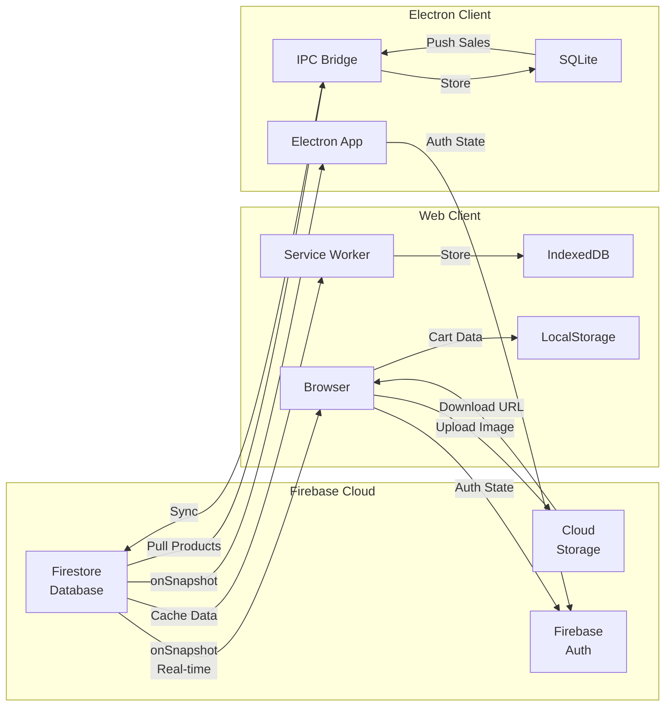
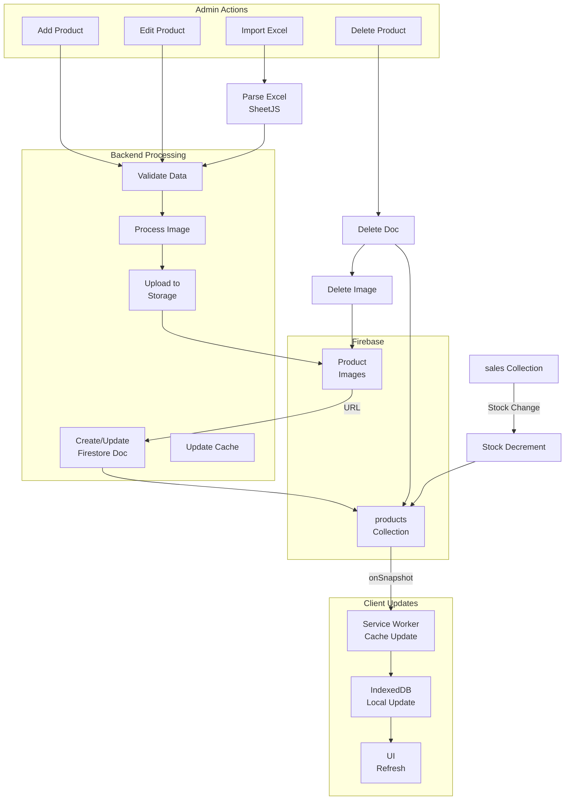
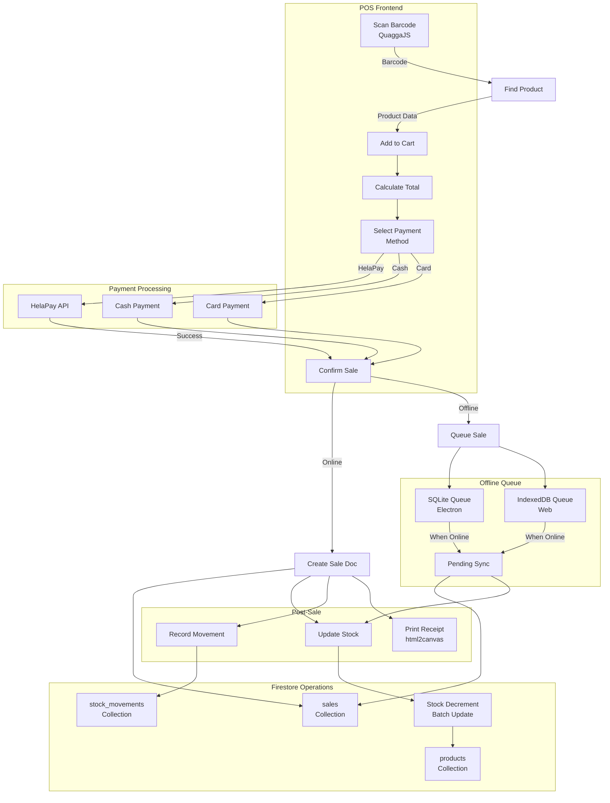
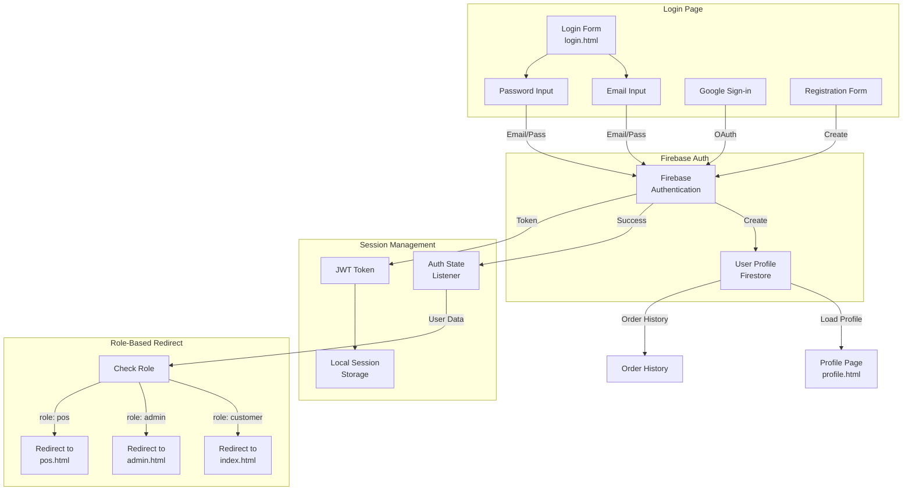
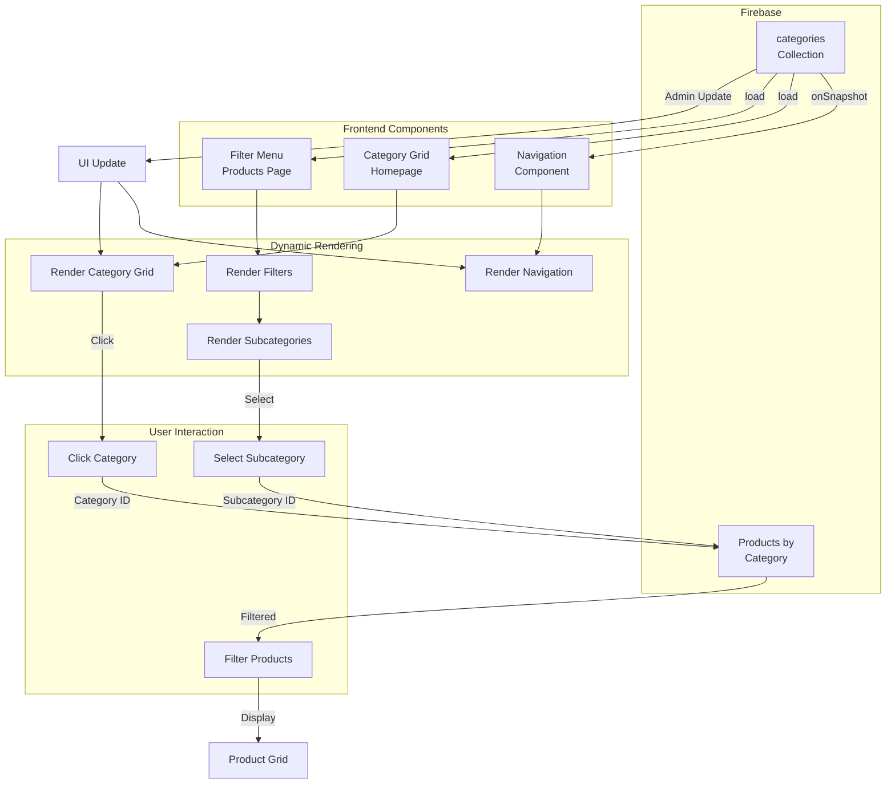
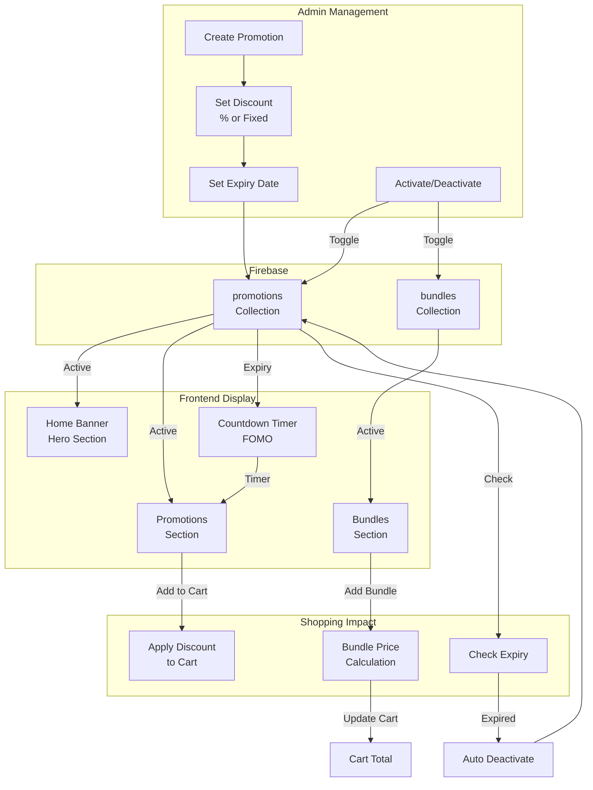
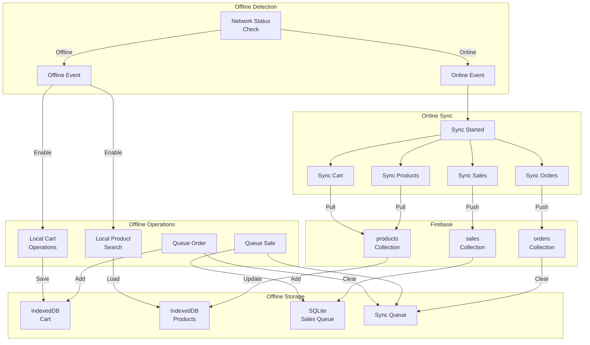
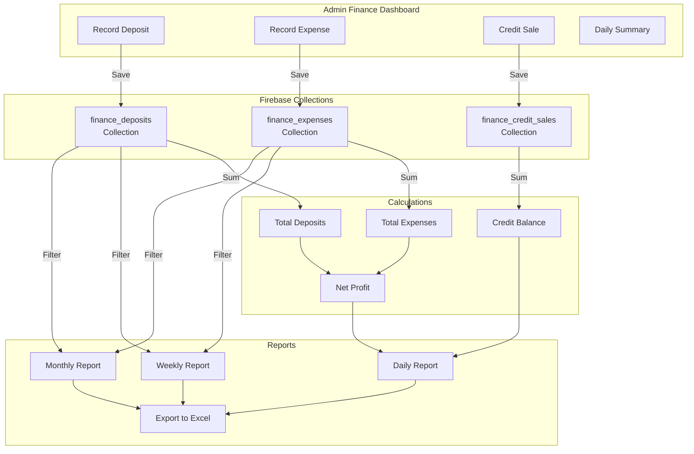
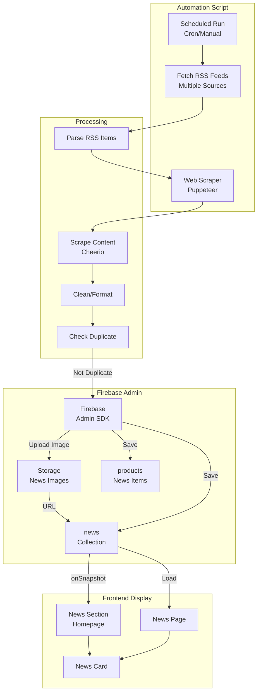

# Buddika Stores - Data Flow Diagrams

> Generated: 2026-04-25

---

## 23. Real-Time Data Sync Flow

---

## 24. Product Management Data Flow

---

## 25. Sales Transaction Data Flow

---

## 26. Authentication Data Flow

---

## 27. Category & Navigation Data Flow

---

## 28. Promotions & Marketing Data Flow

---

## 29. Offline Recovery & Sync Data Flow

---

## 30. Finance Tracking Data Flow

---

## 31. News & Automation Data Flow

