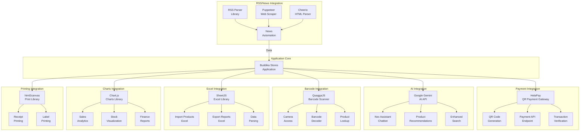
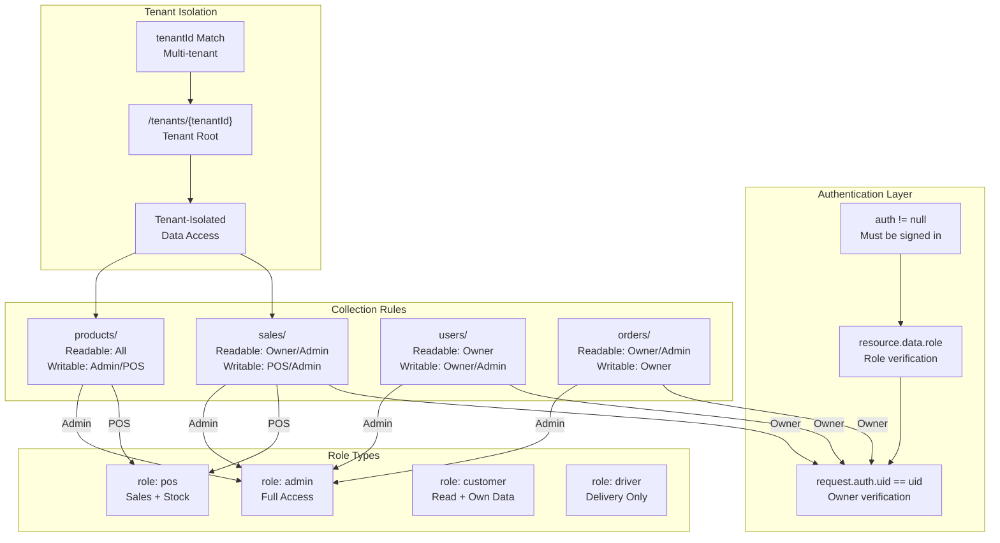
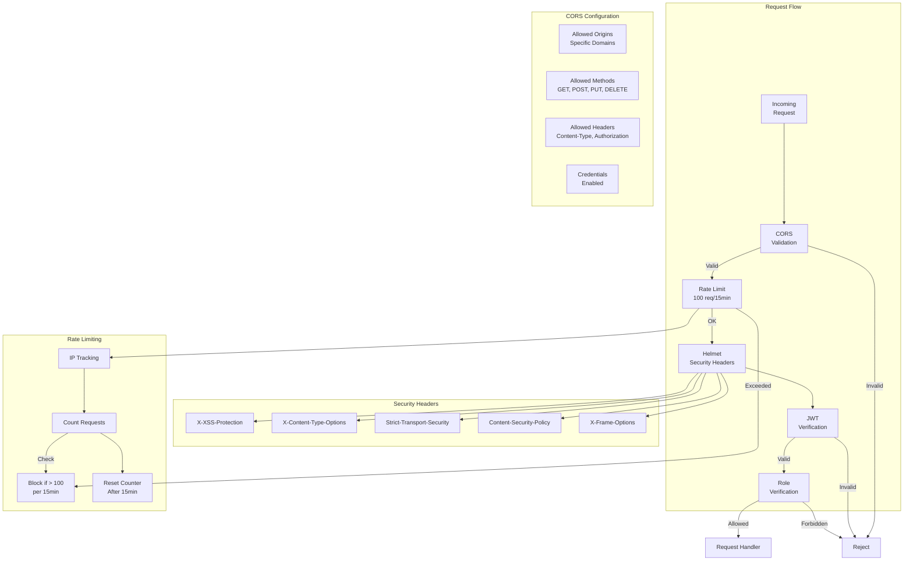
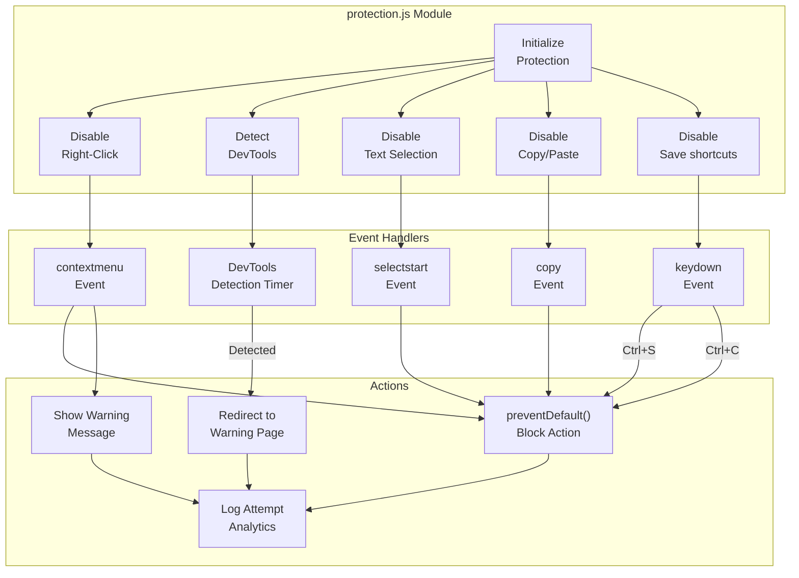
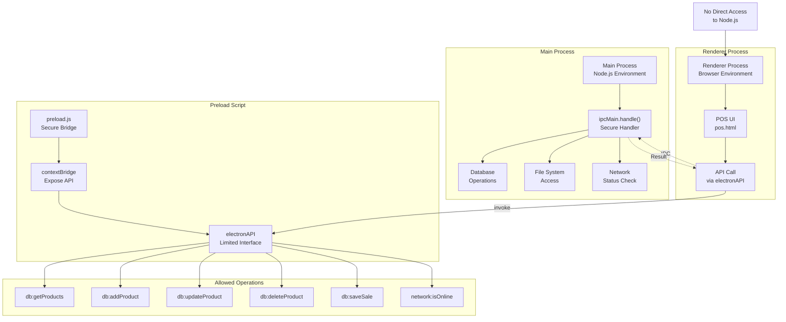
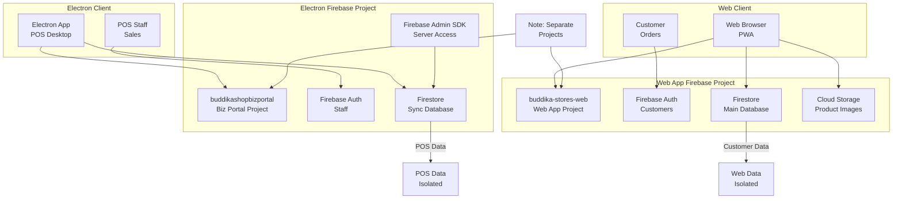
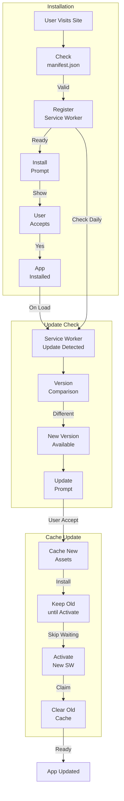
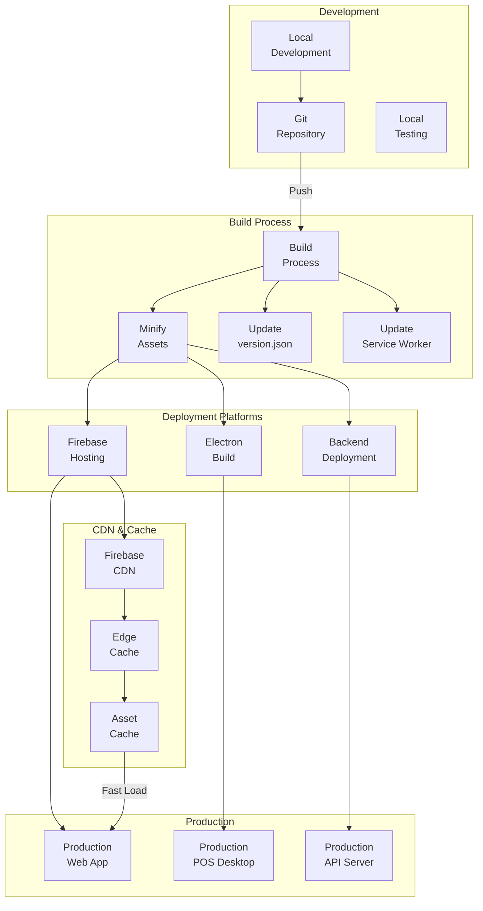
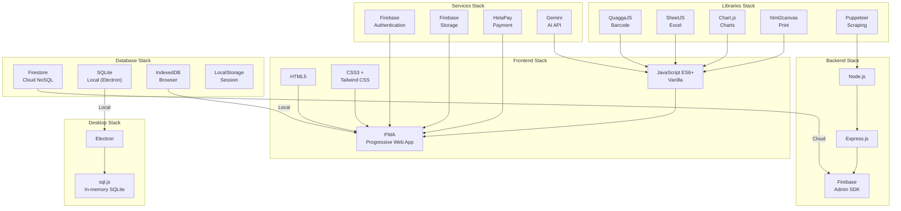

# Buddika Stores - Integration & Security Diagrams

> Generated: 2026-04-25

---

## 32. External Integrations Overview

---

## 33. Firebase Security Model

---

## 34. Backend Security Architecture

---

## 35. Content Protection System

---

## 36. IPC Bridge (Electron Security)

---

## 37. Two Firebase Projects Architecture

---

## 38. PWA Installation & Update Flow

---

## 39. Deployment Architecture

---

## 40. Technology Stack Summary

